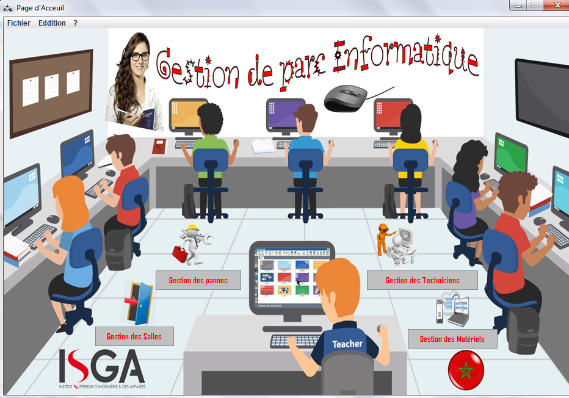

# Projet JEE Swing
## Gestion de parc informatique
Une  application  desktop    JAVA Swing   sous  le  thème  la   gestion  du  parc informatique  a  pour  objectif  de  gère  précisément,  les    gestions  des  matériels,  salle, technicien, panne, du cas d’école ISGA.

### Screenshots :

#### Home

#### Géston de panne

## Tech
- Java Swing
- Hibernate
- Base de données MySQL